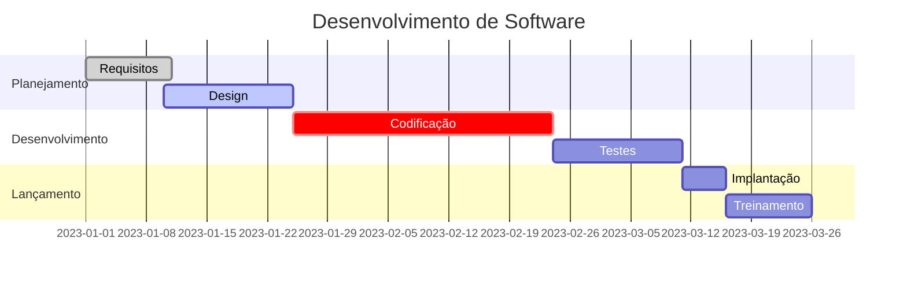
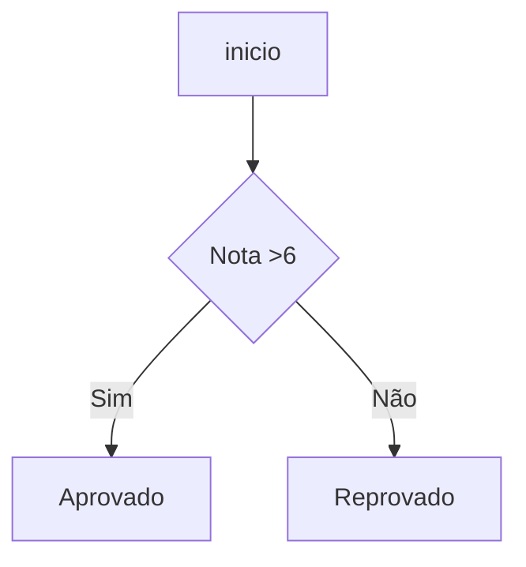
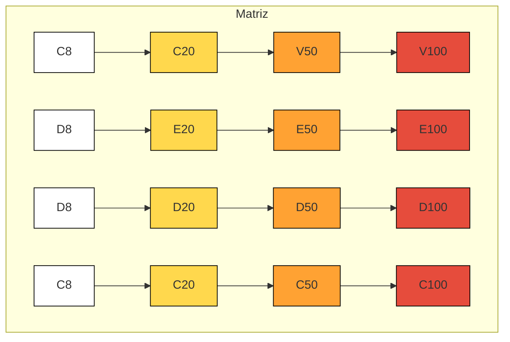

```mermaid
graph TD
    subgraph Matriz
        A1["C8"]:::branco   B1["D8"]:::branco
        A2["C20"]:::amarelo
        A3["V50"]:::laranja
        A4["V100"]:::vermelho

       
        B2["E20"]:::amarelo
        B3["E50"]:::laranja
        B4["E100"]:::vermelho

        C1["D8"]:::branco
        C2["D20"]:::amarelo
        C3["D50"]:::laranja
        C4["D100"]:::vermelho

        D1["C8"]:::branco
        D2["C20"]:::amarelo
        D3["C50"]:::laranja
        D4["C100"]:::vermelho
    end

    classDef branco fill:#fff,stroke:#000,stroke-width:1px;
    classDef amarelo fill:#FFD84D,stroke:#000,stroke-width:1px;
    classDef laranja fill:#FFA233,stroke:#000,stroke-width:1px;
    classDef vermelho fill:#E64C3C,stroke:#000,stroke-width:1px;


```


