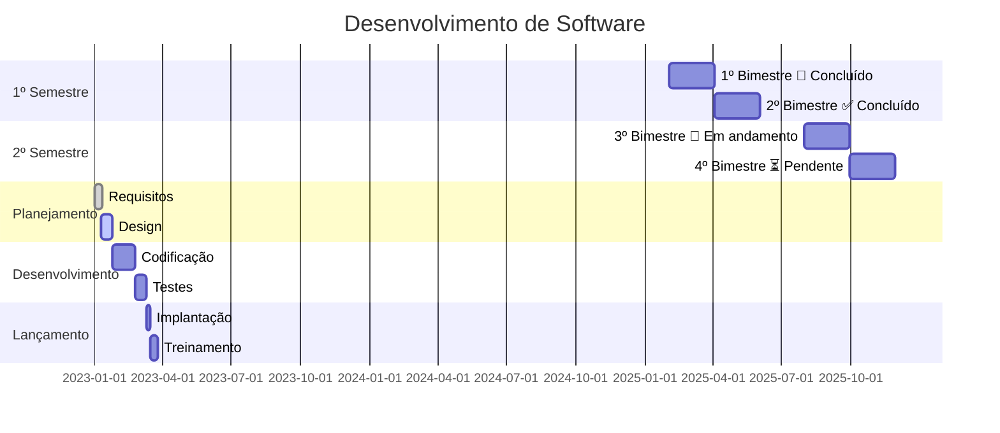
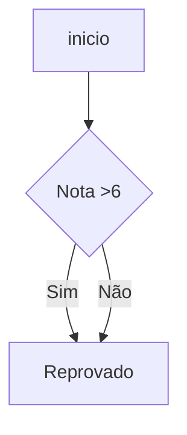

```mermaid
    gantt
    title Exemplo de Gráfico de Gantt
    dateFormat  YYYY-MM-DD

    section 1º Semestre
    1º Bimestre 🔴 Concluído       :a1, 2025-02-02, 60d
    2º Bimestre ✅ Concluído       :a2, after a1, 60d

    section 2º Semestre
    3º Bimestre 🔄 Em andamento    :a3, 2025-08-01, 60d
    4º Bimestre ⏳ Pendente        :a4, after a3, 60d

    title Desenvolvimento de Software
    dateFormat  YYYY-MM-DD
    
    section Planejamento
    Requisitos      :done, req, 2023-01-01, 10d
    Design          :active, des, 2023-01-10, 15d
    
    section Desenvolvimento
    Codificação     :dev, 2023-01-25, 30d
    Testes          :test, after dev, 15d
    
    section Lançamento
    Implantação     :dep, after test, 5d
    Treinamento     :tra, after dep, 10d


  
```

```mermaid
flowchart TD
    A(["Exemplo"])
    A --> B{"Faça um Escolha"}
    B --> C["A"]
    B --> E["B"]
    B --> D["C"]
```

```mermaid
graph TD;
  A[inicio] --> B{Nota >6};
  B -->|Sim| C[Aprovado];
 B --> |Não| C[Reprovado];

```
