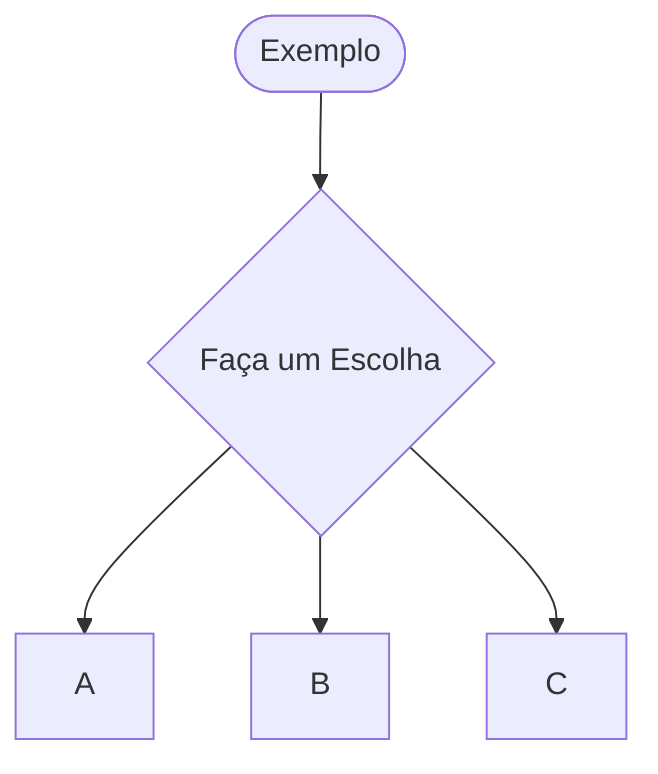
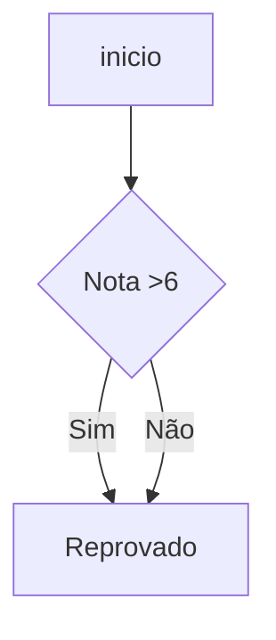

```mermaid
  gantt
    title Exemplo de Gráfico de Gantt
    dateFormat  YYYY-MM-DD

    section 1º Semestre
    1º Bimestre     :a1, 2025-02-02, 60d
    2º Bimestre     :a2, after a1, 60d

    section 2º Semestre
    3º Bimestre     :a3, 2025-08-01, 60d
    4º Bimestre     :a4, after a3, 60d

    %% Definindo os status
    classDef done fill:#4caf50,stroke:#2e7d32,color:#fff
    classDef active fill:#ffc107,stroke:#ffa000,color:#000
    classDef pending fill:#e0e0e0,stroke:#9e9e9e,color:#000

    %% Atribuindo status
    class a1 done
    class a2 done
    class a3 active
    class a4 pending

  
```




