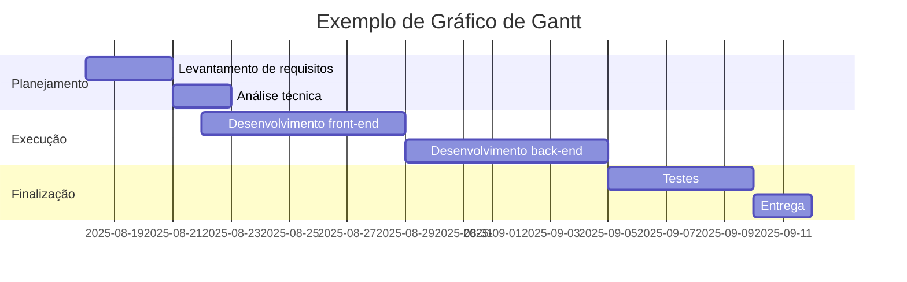

# grafico_gant

```mermaid
gantt
    title Exemplo de Gráfico de Gantt
    dateFormat  YYYY-MM-DD
    section Planejamento
    Levantamento de requisitos :a1, 2025-08-18, 3d
    Análise técnica             :a2, after a1, 2d
    section Execução
    Desenvolvimento front-end   :b1, 2025-08-22, 7d
    Desenvolvimento back-end    :b2, after b1, 7d
    section Finalização
    Testes                      :c1, 2025-09-05, 5d
    Entrega                     :c2, after c1, 2d
```

```mermaid
flowchart TD
    A(["Exemplo"])
    A --> B{"Faça um Escolha"}
    B --> C["A"]
    B --> E["B"]
    B --> D["C"]
```
