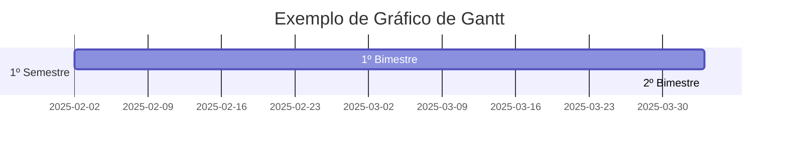
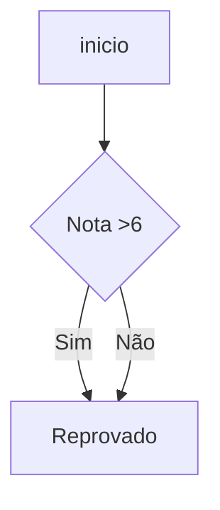

# grafico_gant

```mermaid
gantt
    title Exemplo de Gráfico de Gantt
    dateFormat  DD-MM-YYYY
    section 1º Semestre
    1º Bimestre :a1, 2025-02-02, 60d
   2º Bimestre  :a2, after a1, 60 d
  
```

```mermaid
flowchart TD
    A(["Exemplo"])
    A --> B{"Faça um Escolha"}
    B --> C["A"]
    B --> E["B"]
    B --> D["C"]
```

```mermaid
graph TD;
  A[inicio] --> B{Nota >6};
  B -->|Sim| C[Aprovado];
 B --> |Não| C[Reprovado];

```
