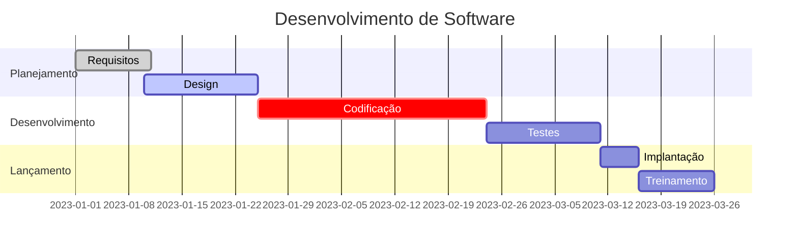
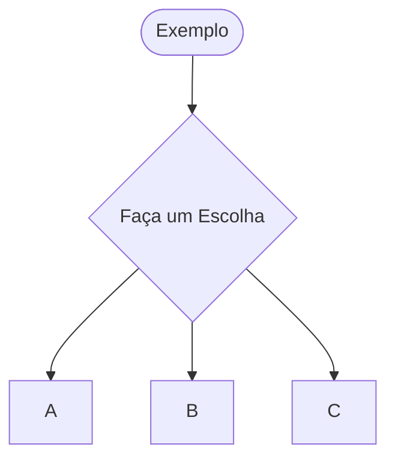
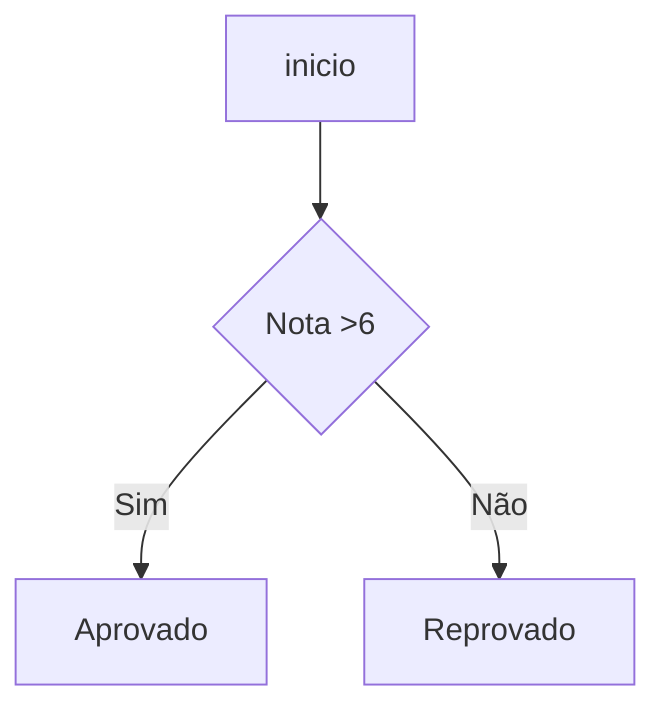
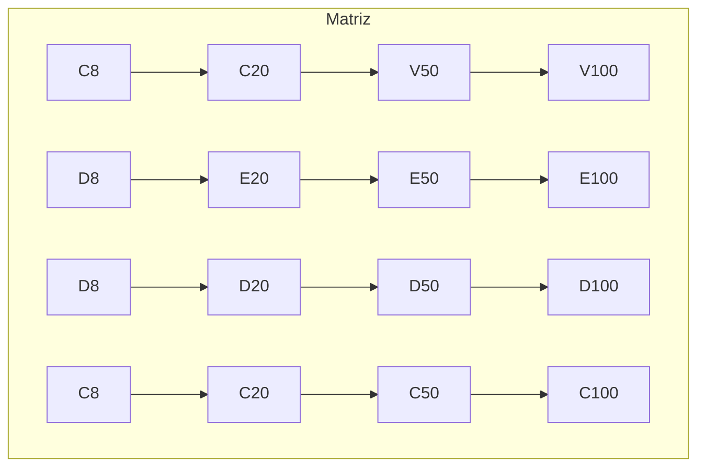

```mermaid
    gantt

    title Desenvolvimento de Software
    dateFormat  YYYY-MM-DD
    
    section Planejamento
    Requisitos      :done, req, 2023-01-01, 10d
    Design          :active, des, 2023-01-10, 15d
    
    section Desenvolvimento
    Codificação     :crit, dev, 2023-01-25, 30d
    Testes          :test, after dev, 15d
    
    section Lançamento
    Implantação     :dep, after test, 5d
    Treinamento     :tra, after dep, 10d


  
```

```mermaid
flowchart TD
    A(["Exemplo"])
    A --> B{"Faça um Escolha"}
    B --> C["A"]
    B --> E["B"]
    B --> D["C"]
```

```mermaid

graph TD;
  A[inicio] --> B{Nota >6};
  B -->|Sim| C[Aprovado];
 B --> |Não| D[Reprovado];

```

```mermaid
graph TD
    subgraph Matriz
        A1["C8"]:::white-->  A2["C20"]:::yellow --> A3["V50"]:::orange --> A4["V100"]:::red
        B1["D8"]:::white --> B2["E20"]:::yellow --> B3["E50"]:::orange --> B4["E100"]:::red
        C1["D8"]:::white --> C2["D20"]:::yellow --> C3["D50"]:::orange --> C4["D100"]:::red
        D1["C8"]:::white-->  D2["C20"]:::yellow --> D3["C50"]:::orange --> D4["C100"]:::red
    end

 


```
