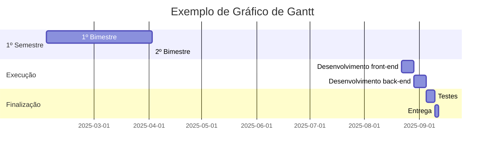
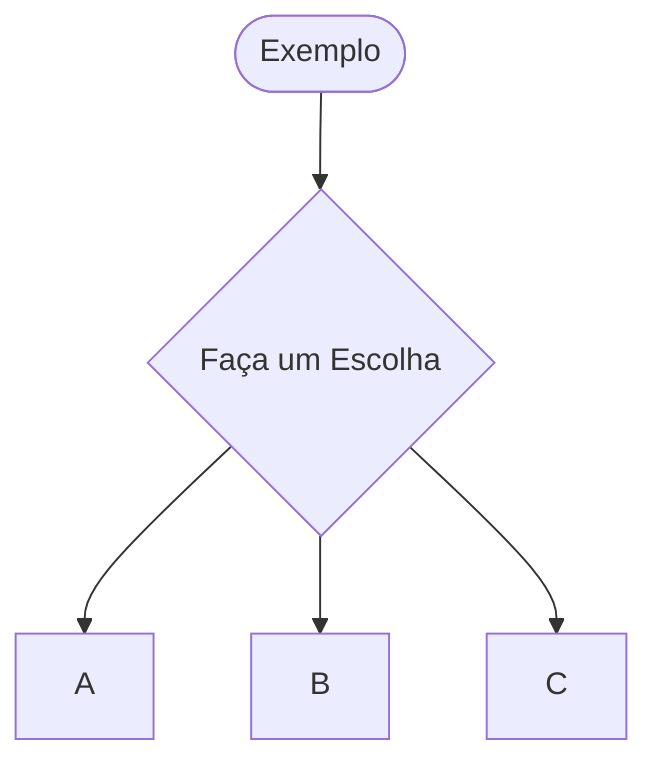
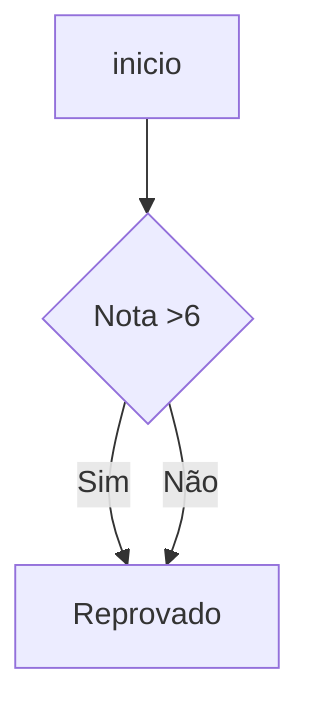

# grafico_gant

```mermaid
gantt
    title Exemplo de Gráfico de Gantt
    dateFormat  DD-MM-YYYY
    section 1º Semestre
    1º Bimestre :a1, 2025-02-02, 60d
   2º Bimestre  :a2, after a1, 60 D
    section Execução
    Desenvolvimento front-end   :b1, 2025-08-22, 7d
    Desenvolvimento back-end    :b2, after b1, 7d
    section Finalização
    Testes                      :c1, 2025-09-05, 5d
    Entrega                     :c2, after c1, 2d
```

```mermaid
flowchart TD
    A(["Exemplo"])
    A --> B{"Faça um Escolha"}
    B --> C["A"]
    B --> E["B"]
    B --> D["C"]
```

```mermaid
graph TD;
  A[inicio] --> B{Nota >6};
  B -->|Sim| C[Aprovado];
 B --> |Não| C[Reprovado];

```
